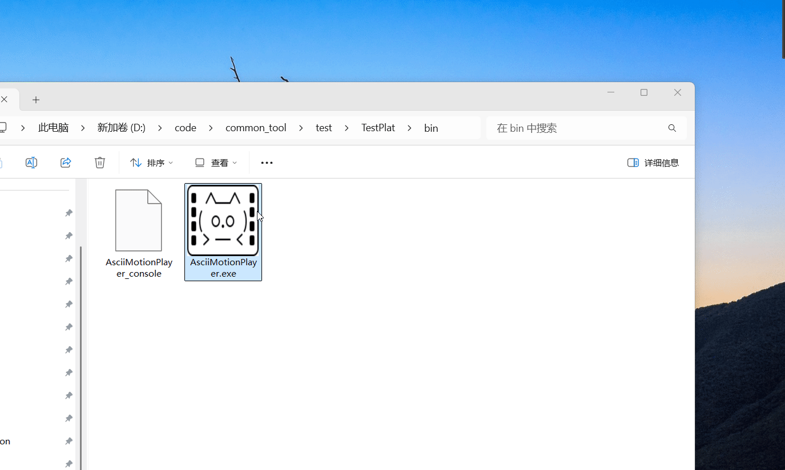

# 🎞️ AsciiMotion
Animating Algorithms with ASCII & Unicode Characters



## 🎬 Player

Tools for playing ASCII animations in terminal or GUI environments.

1. AsciiMotionPlayer 

🔽[Download for Windows (x86_64)](https://github.com/user-attachments/files/22869205/AsciiMotionPlayer_windows_x86_64.zip)

Project address: https://github.com/qindapao/common_tool

2. [asciio](https://github.com/nkh/P5-App-Asciio)

asciio's slides mode, But it plays asciio files, not txt files. 


## ✏️ Editor

Tools for creating and editing frame-based ASCII animations.

1. [asciio](https://github.com/nkh/P5-App-Asciio)
2. [vimio](https://github.com/qindapao/vimio)

## 🤝 Contributing Guidelines

We welcome contributions to this project! To maintain consistency and clarity across all submissions, please follow these rules when adding new content:

### 📁 File and Folder Naming Rules

- **All folder and file names must be unique.**  
  Duplicate names across the project are not allowed.

- **Nested folders must include the names of their parent folders.**  
  For example:

```txt
skip_list/
└── skip_list_delete/
    └── skip_list_delete_1.txt
```

- **All frame files must end with a numeric suffix starting from 1.**  
This number represents the frame index. Example: `skip_list_delete_1.txt`, `skip_list_delete_2.txt`, etc.

---

### 🔤 Frame Content Format

- **All frames must be represented using ASCII or Unicode characters only.**
- No images, binary data, or non-text formats are allowed.
- Each frame should be stored in a `.txt` file.

---

### ✅ Before You Submit

Please make sure:

- Your file and folder names follow the naming rules above.
- Frame numbers are correctly ordered and start from 1.
- All frame content is plain text using ASCII or Unicode.
- Your submission is clearly described in the commit message or pull request.

---

### 🙏 Acknowledgements

We sincerely thank everyone who has contributed to this project — whether through code, ideas, feedback, or encouragement. Your support helps us grow and improve continuously.

Special thanks to contributors who follow the naming and formatting rules — your attention to detail keeps the project clean and scalable.

If you're interested in contributing, we’re excited to collaborate with you!

